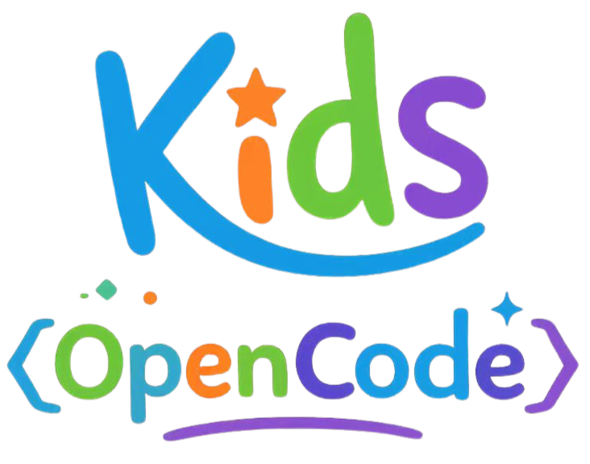
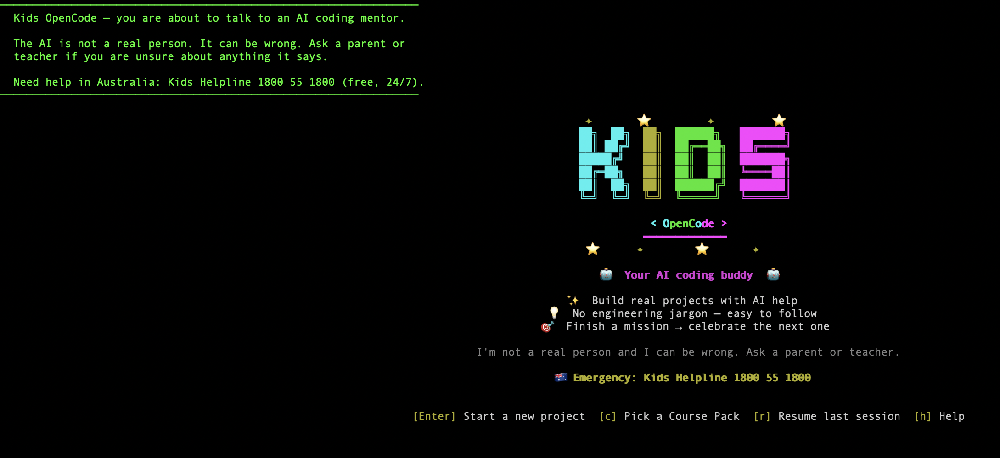
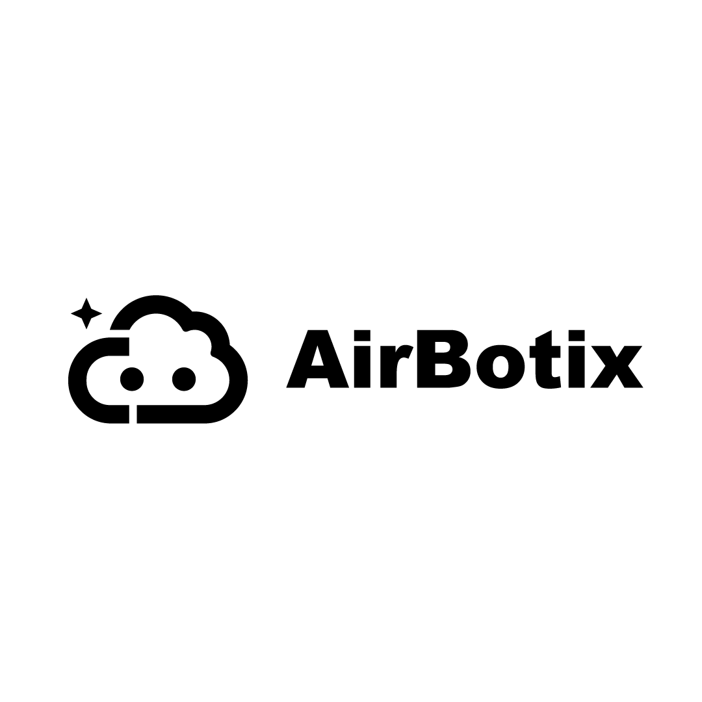

<p align="center">
  
</p>

# Kids OpenCode

> A kid-safe **command-line** AI coding mentor for kids 12+. Built on [opencode](https://github.com/anomalyco/opencode) (MIT).

**Status**: 🟡 V0 in development (Phase 1 done, Phase 2 in progress). **Not yet safe for actual kids**; see [`PLAN.md`](./PLAN.md) for what's left.



---

## What it is

You run one command in a terminal:

```bash
kids-opencode
```

A kid-safe AI coding mentor starts up in your current folder. It will:

- Help your kid plan and build a small project (HTML / CSS / JavaScript, V0)
- Refuse to run shell commands or touch files outside the project folder
- Ask before every single tool use ("I'm about to write `index.html` — OK?")
- Never pretend to be human, never introduce adult topics
- Route all AI calls through DeepRouter so the family gets consistent moderation + a single bill (or use your own API key for free local use; see "Modes" below)

That's the entire user-facing experience. No web app, no desktop GUI, no installer wizard.

## Install

```bash
curl -fsSL https://airbotix.ai/install/kids | sh
```

The installer:
1. Installs the upstream `opencode` CLI if not present.
2. Installs our `@kidsinai/kids-opencode-plugin` via `opencode plugin install`.
3. Drops a kid-safe config at `~/.config/kids-opencode/opencode.json`.
4. Puts a `kids-opencode` wrapper in `/usr/local/bin`.

macOS + Linux supported. Windows installer planned for V1.

## Use

```bash
cd ~/my-project
kids-opencode
```

You'll be prompted for what you want to build. Try:

> "Help me make a personal portfolio website about my favourite hobby."

The mentor will plan it, then ask before writing each file.

## Modes

| Mode | Who pays the LLM bill | When to use |
|---|---|---|
| **DeepRouter (default)** | Family Stars wallet (Airbotix-billed) | Most families. Set `DEEPROUTER_API_KEY` from [app.airbotix.ai/portal/wallet](https://app.airbotix.ai/portal/wallet). Includes the kid-safety moderation pipeline server-side. |
| **Bring-your-own-key** | The family's own Anthropic / OpenAI account | Power users + privacy-first families. Edit `~/.config/kids-opencode/opencode.json` and point `provider` at your own key. **You lose Airbotix's moderation pipeline; client-side plugin still enforces tool whitelist + system prompt.** |
| **School workshop** | School credit pool | When launched via a Workshop class code. Stars bill goes to the school, not the family. |

## How it's different from "just opencode"

| | Vanilla opencode | kids-opencode |
|---|---|---|
| Target age | adult devs | kids 12+ |
| Bash / shell tool | ✅ available | ❌ removed entirely |
| System prompt | dev-style ("write the code") | mentor-style ("never give the whole answer") |
| File access | wherever you run it | restricted to current project folder |
| Web access | open | whitelist: MDN, web.dev, W3C specs, airbotix.ai/docs |
| Provider routing | direct (you bring your own keys) | DeepRouter by default (Airbotix-managed moderation + billing); BYOK supported |
| First-run | configure providers | parent onboarding + age-band selection |

## Repo layout

```
kids-opencode/
├── bin/kids-opencode              # Shell wrapper that exec's `opencode --config <ours>`
├── install.sh                     # Curl-able installer
├── config/
│   ├── opencode.json.template     # Default config preset installed to ~/.config/kids-opencode/
│   └── system-prompt.md           # Canonical kid-safe prompt (also bundled in plugin)
├── packages/kids-plugin/          # @kidsinai/kids-opencode-plugin (published to npm)
│   └── src/
│       ├── index.ts               # Plugin hooks: system prompt, tool whitelist, audit
│       └── system-prompt.ts       # Compiled prompt template
├── course-packs/                  # Bundled missions (V0: portfolio website; more coming)
├── docs/
│   ├── upstream-architecture.md   # 1-page audit of opencode internals
│   └── compliance/                # Per-jurisdiction compliance audit (au.md, etc.)
├── PLAN.md                        # Phase-by-phase to V0
└── KIDSINAI.md                    # Product notes
```

## Two-repo split

- **`kidsinai/kids-opencode`** (this repo) — product code. Plugin, config, wrapper, course packs.
- **`kidsinai/opencode-kernel`** — upstream tracking fork of `anomalyco/opencode`. Pristine; we don't import from here.

Product code consumes opencode via npm (`@opencode-ai/sdk`, `@opencode-ai/plugin`), never via source.

## Cross-repo dependencies

- **DeepRouter** (`~/Documents/sites/deeprouter-ai/deeprouter/`) — LLM gateway. All managed-mode traffic flows through it. Where moderation, OpenAI ZDR injection, and per-family billing actually happen.
- **`Airbotix-AI/platform-backend`** — issues per-family DeepRouter API keys, stores parental consent records, persists audit log. The `Airbotix-AI/airbotix-app` SPA is the parent-facing portal that surfaces all of this.
- **`Airbotix-AI/airbotix`** — marketing site, hosts `airbotix.ai/install/kids` and public compliance docs.

## Backed by

<p align="center">
  <a href="https://www.airbotix.ai/"></a>
  &nbsp;&nbsp;&nbsp;&nbsp;
  <a href="https://www.unisq.edu.au/"></a>
  &nbsp;&nbsp;&nbsp;&nbsp;
  <a href="https://www.csiro.au/"></a>
</p>

Kids OpenCode is built by **Airbotix** in formal collaboration with the **University of Southern Queensland (UniSQ)** and **CSIRO** (via the RUIC program).

## License

MIT — same as upstream opencode. Repo is currently private; will go public alongside V0 launch.

---

## V0 what-works / what-doesn't

✅ **Works now (Phase 1 done)**:
- Wrapper script, install script, config template, kid-safe plugin (tool whitelist, system prompt, audit emission)
- DeepRouter integration path validated via SDK type-check
- Compliance audit for AU jurisdiction (`docs/compliance/au.md`)

🟡 **In progress**:
- Real end-to-end run (needs an API key on someone's machine)
- Course Pack bundle (first mission: portfolio website)
- npm publish of the plugin

🔴 **Hard blockers before any real kid uses this**:
- Lawyer review of AU compliance (`docs/compliance/au.md` §9 — 8 open items)
- Public privacy policy + ToS + parental consent forms on airbotix.ai
- Real DeepRouter staging tenant + per-family key issuance (platform-backend side)
- Red-team test set: at least 50 prompt-injection / jailbreak attempts that the plugin + DeepRouter must safely refuse

See [`PLAN.md`](./PLAN.md) for the full punch list.
